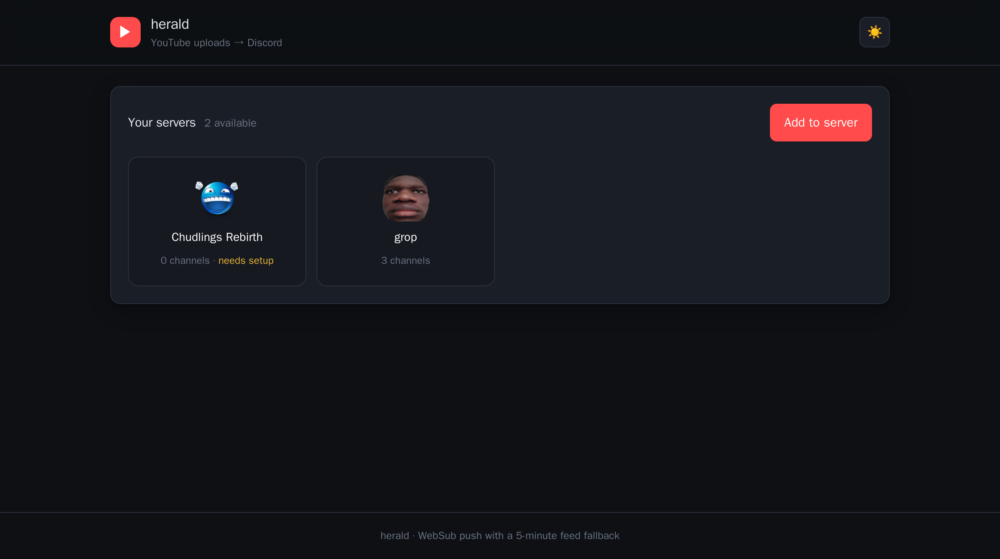
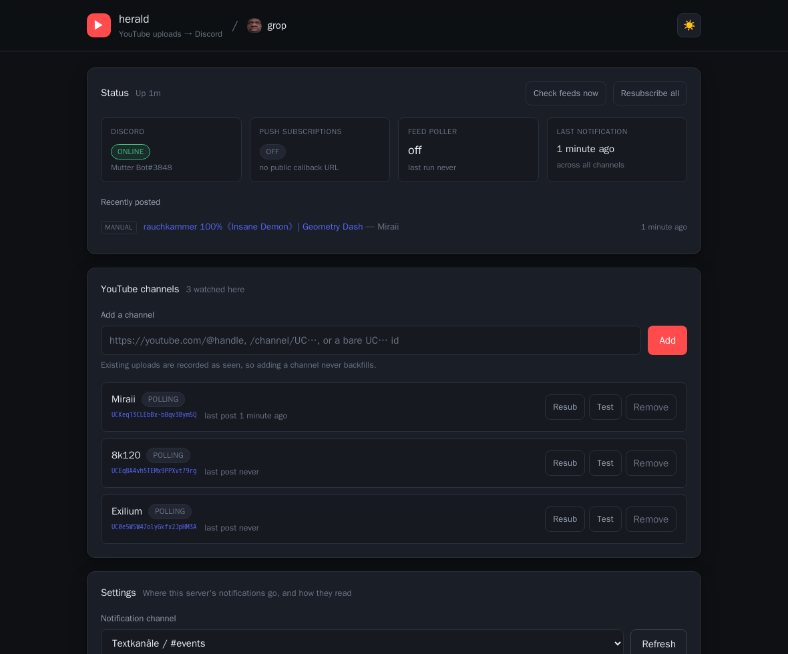

<p align="center">
  <picture>
    <source media="(prefers-color-scheme: light)" srcset="./docs/logo-light.svg">
    
  </picture>
</p>

<h1 align="center">herald</h1>

<p align="center">
  A small self-hosted Discord bot that announces new YouTube uploads —
  many servers, one container, no accounts to sign up for.
</p>

<p align="center">
  <a href="https://github.com/BBareth/herald/actions/workflows/ci.yml"></a>
  <a href="https://github.com/BBareth/herald/pkgs/container/herald"></a>
  <a href="./LICENSE"></a>
  
</p>

---

Point it at a YouTube channel, pick a Discord channel, and it posts there when
something new goes up.

- **A dashboard per server.** Sign in with Discord and you get the servers where
  you hold Manage Server, each with its own watched channels, its own
  notification channel, and its own message template — the way MEE6 and friends
  work. One bot covers as many servers as you like.
- **Push first, polling always.** It subscribes to YouTube's
  [WebSub](https://developers.google.com/youtube/v3/guides/push_notifications)
  hub so uploads arrive within seconds, and *also* reads the RSS feed on a timer.
  Google's hub is unreliable — it throttles, and it silently drops
  subscriptions — so the poller is not a fallback you hope never runs. It is the
  reason the bot keeps working when push breaks.
- **It tells you the truth about itself.** Every subscription reports whether a
  push has actually been delivered, not merely whether a handshake was answered.
  See [subscription states](#subscription-states).
- **No back catalogue.** Adding a channel records its existing uploads as seen,
  so nobody gets twenty messages at once.

<p align="center">
  
  <br>
  <em>Pick a server.</em>
  <br><br>
  
  <br>
  <em>Then manage just that one.</em>
</p>

> [!IMPORTANT]
> **Set `DISCORD_CLIENT_ID` and `DISCORD_CLIENT_SECRET` if anyone but you can
> reach the dashboard.** Without them there is no login and whoever opens the
> page can manage every server the bot is in. That default is deliberate — it
> keeps a LAN-only install friction-free — but it is the wrong default the
> moment the port is reachable from elsewhere. See [SECURITY.md](./SECURITY.md).

## Quick start

```bash
docker run -d --name herald \
  -p 8080:8080 \
  -v herald_data:/data \
  -e DISCORD_BOT_TOKEN=your_token_here \
  --restart unless-stopped \
  ghcr.io/bbareth/herald:latest
```

Open <http://localhost:8080>, click **Add to server**, invite the bot, then pick
the server and add a YouTube channel.

That is enough to work. Uploads arrive within five minutes through the feed
poller. To get them within *seconds*, add a public HTTPS URL — see
[Push notifications](#push-notifications-optional).

<details>
<summary><b>docker compose</b></summary>

Grab [`docker-compose.yml`](./docker-compose.yml) and
[`.env.example`](./.env.example):

```bash
cp .env.example .env
$EDITOR .env          # at minimum, set DISCORD_BOT_TOKEN
docker compose up -d
```

</details>

<details>
<summary><b>Build it yourself</b></summary>

```bash
git clone https://github.com/BBareth/herald.git
cd herald
docker build -t herald .
docker run -d -p 8080:8080 -v herald_data:/data -e DISCORD_BOT_TOKEN=... herald
```

</details>

## Setting it up

Full walkthroughs, including every click in the Discord developer portal:

- **[docs/SETUP.md](./docs/SETUP.md)** — step by step, for a human.
- **[docs/AGENT.md](./docs/AGENT.md)** — the same deployment as a checklist for
  a coding agent, with the commands and the checks that prove each step worked.

The short version:

1. Create an application at
   [discord.com/developers/applications](https://discord.com/developers/applications),
   add a bot, copy the token into `DISCORD_BOT_TOKEN`.
2. Start the container.
3. Open the dashboard, **Add to server**, authorise it somewhere you manage.
4. Back on the dashboard, pick that server, choose a notification channel, save.
5. Add a YouTube channel by URL, `@handle`, or `UC…` id.
6. Press **Test** to confirm a message actually lands.

## Push notifications (optional)

Without a public URL the bot polls YouTube's RSS feeds every five minutes, which
is fine for most people. With one, YouTube pushes uploads the moment they happen.

You need an HTTPS address that reaches the container — a reverse proxy, a
[Cloudflare Tunnel](https://developers.cloudflare.com/cloudflare-one/connections/connect-networks/),
Tailscale Funnel, anything. Then:

```dotenv
WEBSUB_CALLBACK_BASE_URL=https://herald.example.com
WEBSUB_VERIFY_TOKEN=$(openssl rand -hex 24)
WEBSUB_SECRET=$(openssl rand -hex 48)
```

Only `/api/websub/callback` needs to be public. Everything else can stay private,
and the endpoint verifies an HMAC signature on every delivery, so exposing just
that path is safe.

> [!TIP]
> If you put Cloudflare in front of it, **exempt the callback path from Bot Fight
> Mode and any WAF rules**. Google's hub is not a browser; challenge it and your
> subscriptions quietly stop verifying, which looks exactly like the bot being
> broken. [docs/SETUP.md](./docs/SETUP.md#behind-cloudflare) has the details.

## Subscription states

The dashboard reports what it can actually prove, which matters because a
WebSub subscription can look healthy while delivering nothing.

| State | Meaning |
| --- | --- |
| `active` | A push has genuinely been delivered. The subscription works. |
| `verified` | The hub confirmed the lease and nothing has been uploaded since. Normal for a quiet channel — **not** a problem. |
| `degraded` | The poller posted an upload more than 15 minutes old that a live subscription should have pushed. This is the real "push is broken" signal, and it triggers a re-subscribe. |
| `polling` | Push is switched off because no public callback URL is configured. The feed poller is the delivery path. |
| `pending` | A subscribe request is in flight, waiting for the hub to verify. |
| `failed` / `expired` | The hub rejected the request, or the lease lapsed. Renewal retries automatically. |

## Message template

Per server, under **Settings**. Default: `{title} - {link}`

| Placeholder | Becomes |
| --- | --- |
| `{title}` | The video title |
| `{link}` | The watch URL |
| `{channel}` | The YouTube channel name |
| `{author}` | The uploader as the feed reports it |
| `{videoId}` | The bare video id |

Mentions work — `<@&ROLE_ID> {title} - {link}` pings a role.

## Configuration

Everything is environment variables; see [`.env.example`](./.env.example) for the
annotated list. The ones that matter:

| Variable | Default | What it does |
| --- | --- | --- |
| `DISCORD_BOT_TOKEN` | — | **Required.** Your bot's token. |
| `DISCORD_CLIENT_ID` / `DISCORD_CLIENT_SECRET` | — | Enable Discord login. Strongly recommended unless the dashboard is private. |
| `PUBLIC_BASE_URL` | `http://localhost:8080` | Where the dashboard is reached. Must match the OAuth redirect you register. |
| `WEBSUB_CALLBACK_BASE_URL` | — | Public HTTPS base for push. Blank disables push. |
| `WEBSUB_VERIFY_TOKEN` / `WEBSUB_SECRET` | — | Required when push is on. |
| `POLL_INTERVAL_MS` | `300000` | Feed poll interval. `0` disables polling. |
| `POLL_MAX_PER_PASS` | `3` | Cap on messages per channel per pass, so an outage cannot flood a server. |
| `DATABASE_PATH` | `/data/herald.db` | SQLite file. Keep it on a volume. |
| `LOG_LEVEL` | `info` | `debug`, `info`, `warn`, `error`. |

## How it works

```
YouTube ──push──> /api/websub/callback ─┐
                                        ├─> dedupe ─> fan out to every server
YouTube ──RSS───> feed poller ──────────┘            watching that channel
```

One WebSub subscription is shared by every server watching the same creator; the
tenth server to add a channel costs nothing extra. Delivery is deduplicated per
server against a unique `(watch, video)` index, so a push and a poll racing over
the same upload can never double-post, and each server keeps its own history.

State lives in one SQLite file. There is no external database, queue, or cache.

## Development

Node 22+.

```bash
# terminal 1 — API on :8080
cd backend && npm install && npm run dev

# terminal 2 — dashboard on :5173, proxying /api to :8080
cd frontend && npm install && npm run dev
```

See [CONTRIBUTING.md](./CONTRIBUTING.md).

## Licence

MIT — see [LICENSE](./LICENSE).
